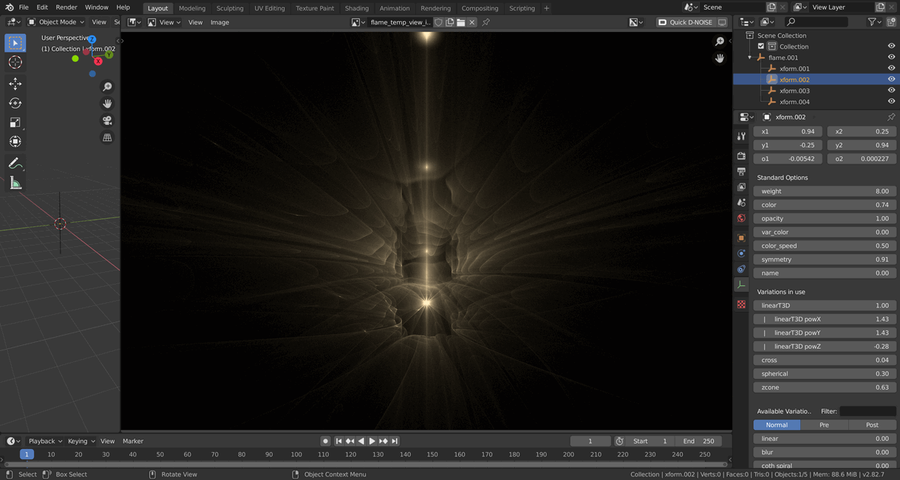
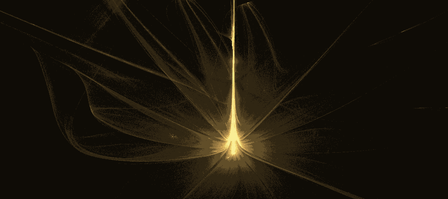

# Blender-EmberRender-Addon
A Blender addon for rendering Flame fractals with EmberRender

**Create a new flame with `Shift-A -> Mesh -> Add Flame Object`**

**Import an existing flame file via `File -> Import -> Import Flame Data`**

Imported flames wont always match exactly as the order of the variations apparently, actually matters. This should be fixed in the future.

**For the preview to work the .blend file must be saved.**

Preview setting are located in the Render Properties panel

Flame and xform properties are located in the Object Data Properties panel

To add more xforms, duplicate an xform. The xforms must be parented to flames

The preview can be viewed in the image editor as well as the data property panel.

### For saving an animated sequence of .flame files:
 - Animate flame & xform properties
 - Set animation in/out points
 - Run export Export Flame Animation operator
 - Currently, a set of .flame files will be created in the same directory as the .blend file is saved. (This will use a choose folder dialog box in the future)
 

### TODO
- Batch render from blender
- File dialog and progress bar for export flame animation
- Export single flame
- Maintain variation order
- Variation disable button
- Progressive Quality Steps 1, 10, 100?
- Better UI for variations
- Make preview work when .blend file is not saved
- Color palette picker/editor 
